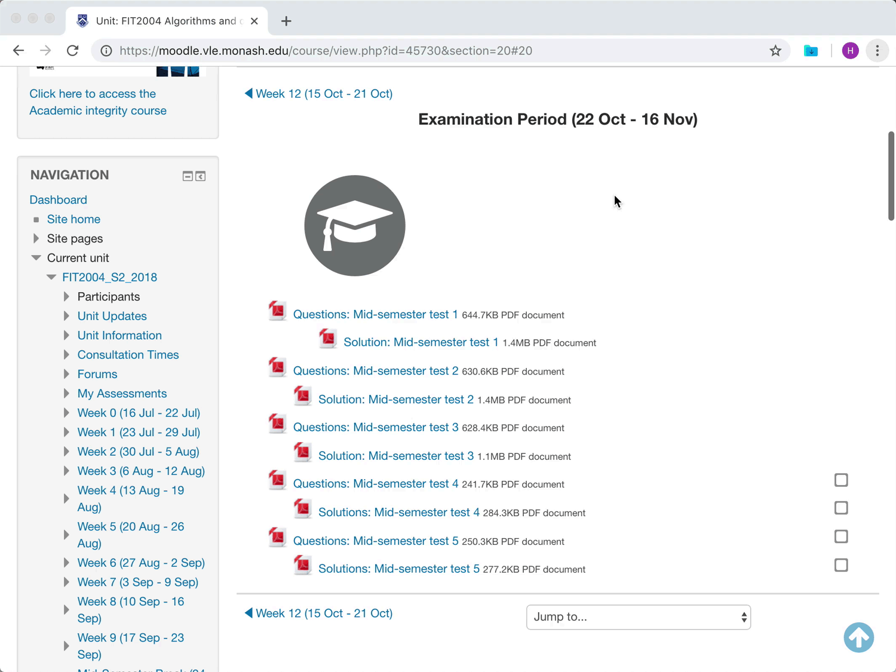

# MoodleDownloader
A chrome extension for downloading Moodle resources 💾

## Download ⬇️
Install the latest version of MoodleDownloader from [Chrome Web Store](https://chrome.google.com/webstore/detail/moodle-downloader/ohhocacnnfaiphiahofcnfakdcfldbnh).

If you prefer to install manually, you can find the latest binaries [here](https://github.com/harsilspatel/MoodleDownloader/releases/latest).

## Usage 🖱
1. Login in to your moodle (for example https://moodle.vle.monash.edu)
2. Open the week (section) from where you would like to download the resources from
3. Click on the extension icon and select the resources to be downloaded.
    - Click and drag or use ⌘ key to select multiple options:
4. Hit the `Download` button to get the resources!

## GIFs 🎞
### Without MoodleDownloader 😩
~38 seconds to download 10 files

### With MoodleDownloader 🤩
~10 seconds to download 10 files

 
 

#### Motivation 💡
Realised in the week 11 that I don't have most of the resources 😭

 

#### Credits 👏🏻
Icon made by [kiranshastry](https://www.flaticon.com/authors/kiranshastry) from [flaticon](https://www.flaticon.com)

 

#### License 📑
[MIT](LICENSE.md)
